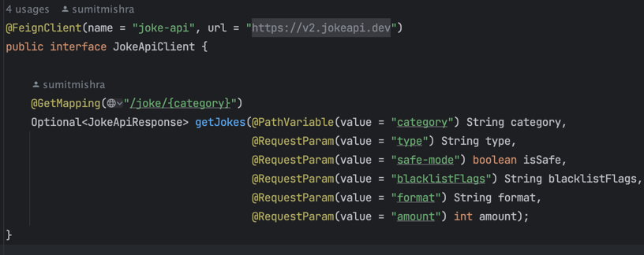

<!-- README.md for the solution -->

# NS International Coding Assignment Solution

<!-- ABOUT THE PROJECT -->

## NS Random Joke Service

### Built With

#### Language, Framework - `Java(17)` `Spring boot 3.1.2`

#### Build Tool - `Gradle`

<!-- Solution Design -->

## Solution Design Process

#### Step 1 - High-level Requirement Analysis

- Control Flow
    - Receive request
        - -> Call external API
            - -> Filter
                - -> Sort
    - Send response back
- The above process is broadly categorised into 2 parts
    - downstream-service (ns-random-joke-service)
    - upstream-service  ([joke api](https://v2.jokeapi.dev/))
- Downstream service is dependent on upstream service in order to serve the response
- Therefore, for resiliency a fallback system needs to be in place when upstream service fails
- Error/Exception handling of both downstream & upstream service

#### Step 2 - Creating & structuring all the layers

* Data & Object modelling (segregation, isolation of value & transfer objects)
* Setup the `controller`, `service`, `config`, `dto` packages
* Setup client (`open feign`) to consume upstream service (configured source url for joke retrieval)
* Refine HTTP responses for the downstream service
* Setup centralised exception handling
* Setup application logging (helps for debugging and observability)

```
Note : The above steps are not necessarily in exact sequence. 
I followed a standard approach & practice towards breaking up the tasks.
It facilitates towards an easy and iterative changes.
During the development the code was continuously refactored.
(Refactored with principles like SOLID, DRY & YAGNI)
```

#### Step 3 - Finding pattern & refactoring

- As I gradually implemented the code, calling the external API and filtering is achieved in one step i.e. through
  utilising API
  request parameter supports. 

- As mentioned above in Step 1, control flow, it felt like a template-pattern design but as I progressed for
  refactoring, made the code smaller and easy.
  At the end except MVC any other pattern was not necessary to the need of the task
  <br /><br />

- **Isolate**, **Improve** & **Inline** : iteratively improved the code

* **Java Records** are used for DTO. Sorting the jokes by length was achieved when the api response object was created.
  
  
  <br /><br />

* **Fallback scenarios are leveraged through resilience4j**<br />
  Using [resilience4j](https://resilience4j.readme.io/docs), easy to integrate & use with java, spring boot and
  annotation based
  <br /><br />

* In the light of resiliency, the responsibility of fallback method is to serve the request with an appropriate response
  whenever possible.

* Therefore, every successful response from Joke API and when the length of the joke is less than 100 characters then
  that joke is cached.

* So whenever there is any failure from getting the response from Joke API, app falls back to cached content to serve
  the request with a cached random joke.
  <br /><br />

* $\color{orange}{\textsf{What can be better?}}$ <br />
  To meet the timeline few functionalities are missed (Anyway, I'll try to implement later...)

- In order to have a consistent request & response in place, it'd be good if we make this code follow a standard.
- Most of the code functionality coverage with unit tests is there, except for caching mechanism (wanted to proceed with
  TDD approach, yet it's time-consuming)
- Although caching is optimised to keep only jokes which are less than 100 characters, still a cache eviction mechanism
  can still be improved.
- Metrics(through spring actuator) are exposed for all kinds of info, may not be needful for production env. At the
  moment it is setup for debug.

## How to run

#### Prerequisites

In order to run the project system needs to have the following :

  ```
  Java(17+), Gradle (also needs to be accessible in your user/global classpath)
  Gradle wrapper is included for convenience, just in case if you want to run the app directly 
  ```

#### command to run

  ```
  : ./gradlew bootRun 
   ``` 

Another alternative is specifying the profile

  ```  
  : ./gradlew bootRun --args='--spring.profiles.active=dev'

  -- Go to the root directory of the project where you see 'gradlew' and run the above command.
  ```

Default profile is set to `dev`. Change profiles by supplying the profile name. <br />

  ```
  : ./gradlew bootRun --args='--spring.profiles.active=prod'
  ```

profiles : `dev`, `staging`, `prod`
<br />

Sample Request : for dev profile
```
GET http://localhost:8080/joke
```
Sample Response :
```
{
    "id": 40,
    "randomJoke": "Debugging: Removing the needles from the haystack."
}
```
